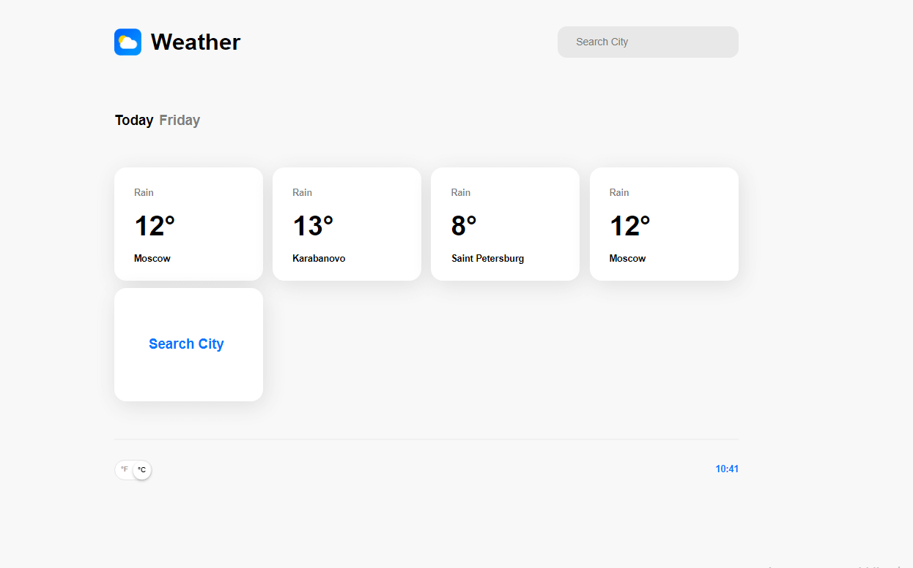
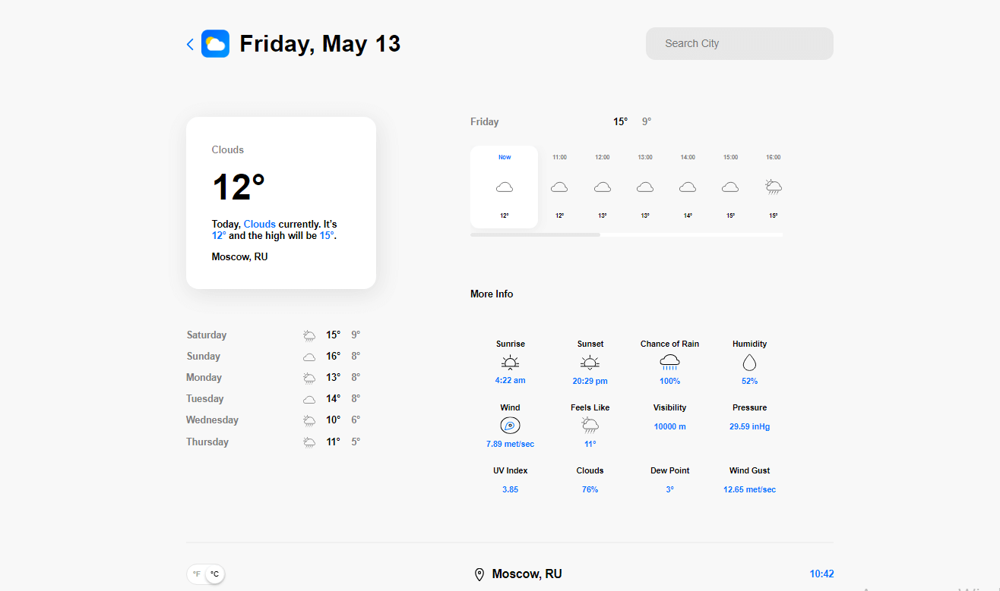
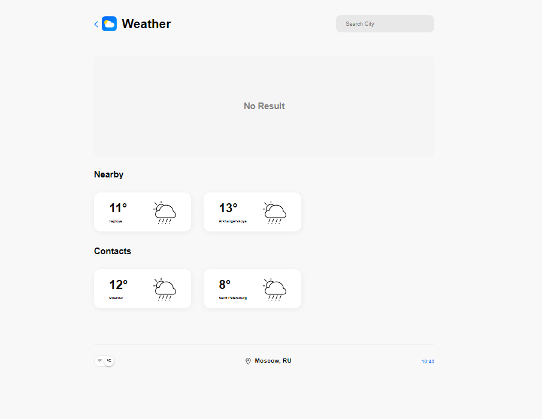
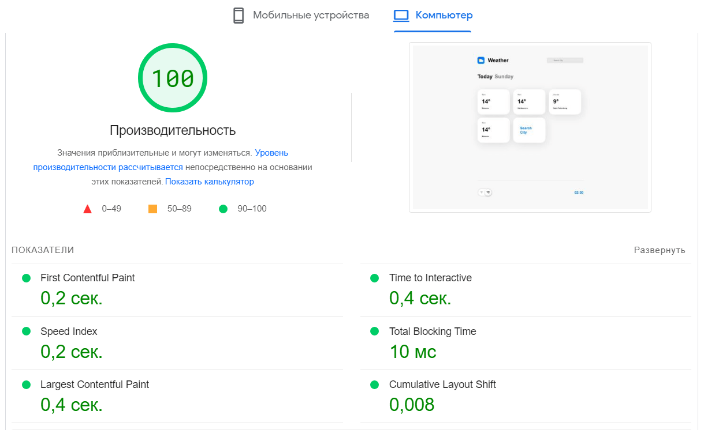

# Weather 

> SPA для просмотра прогноза погоды. 

https://weather-nine-phi.vercel.app/

## Описание

При открытии приложения отображается список из нескольких городов. Нажав на любой из них мы попадаем на страницу выбранного города. На странице города мы видим карточку города с текущей температурой и минимальную температуру за день с максимальной. Так же мы можем посмотреть почасовой прогноз погоды, прогноз на ближайшую неделю и дополнительные погодные показатели.

Нажав на карточку "Search City" мы переходим на страницу поиска города. Там мы видим карточки двух близких к вам городов (если вы разрешили отслеживать геопозицию) и карточки городов каких-то ваших контактов. В строке "Search City" мы можем ввести интересующий нас город и перейдем на страницу этого города (так же данный поиск можно сделать с любой другой страницы данного сайта).

В левом нижнем углу присутствует переключатель единиц измерения. При нажатии мы можем переключить с цельсии на фаренгейты и наоборот.

## Команды

<table>
  <thead>
    <tr>
      <th>Команда</th>
      <th>Результат</th>
    </tr>
  </thead>
  <tbody>
    <tr>
      <td width="30%"><code>npm install</code></td>
      <td>Установить зависимости</td>
    </tr>
    <tr>
      <td><code>npm start</code></td>
      <td>Запустить приложение в режиме разработки.</td>
    </tr>
     <tr>
      <td><code>npm test</code></td>
      <td>Запуск тестов</td>
    </tr>
    <tr>
      <td><code>npm run build</code></td>
      <td>Собрать проект для продакшена</td>
    </tr>
  </tbody>
</table>

## Используемые технологии

React, React Router, React Hooks

## API

<a href="https://openweathermap.org/api">OpenWeather</a>

